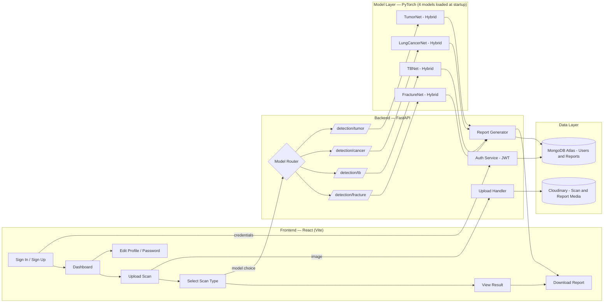
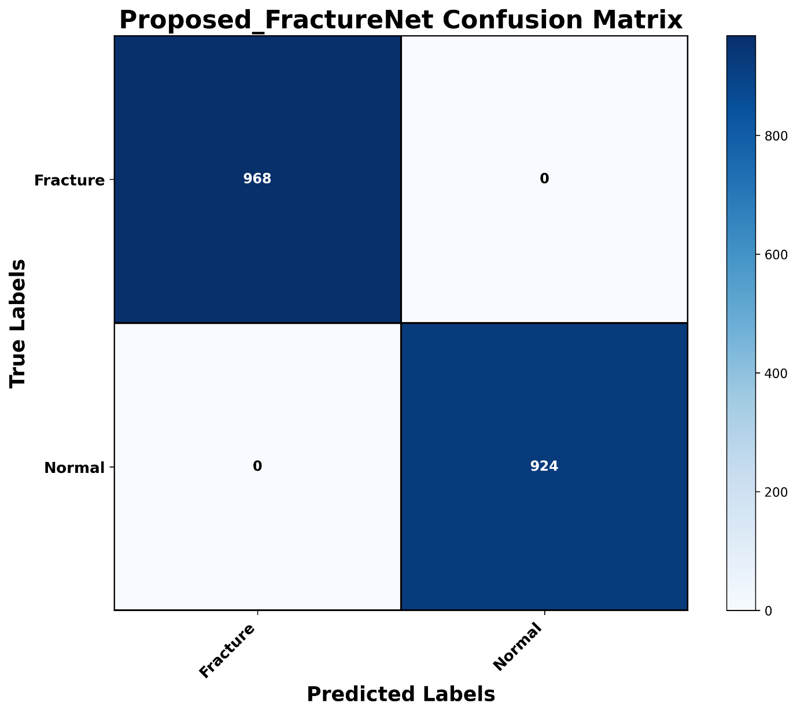
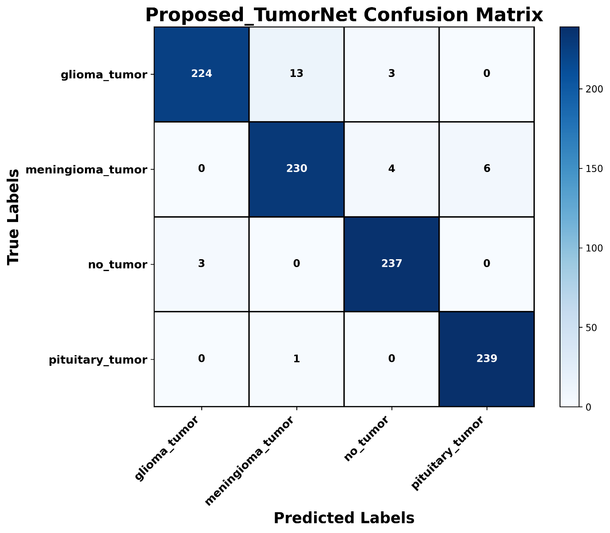
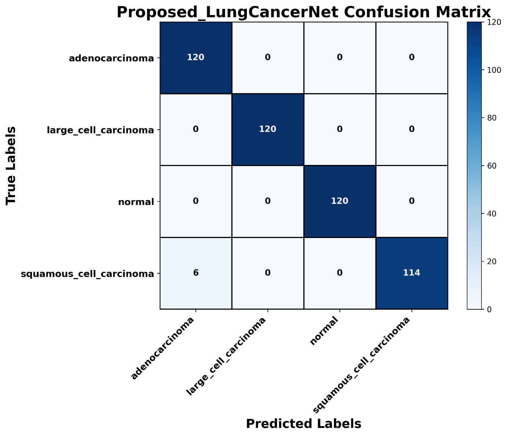
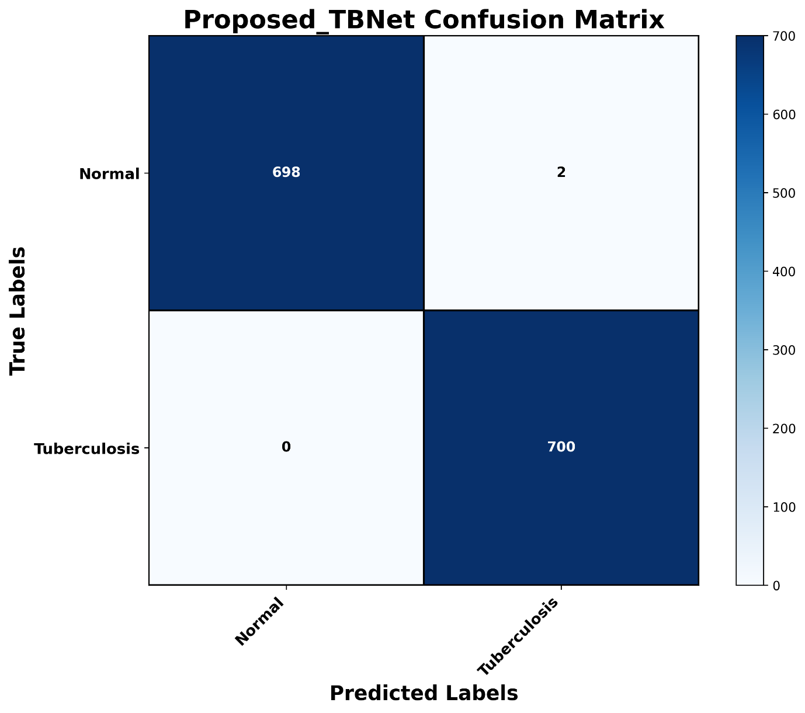

<div align="center">

# 🩻 MedScan AI

### AI-Powered Multi-Disease Detection from Medical Imaging (X-Ray · CT · MRI)

*Upload a scan. Select a model. Get an instant, downloadable diagnostic report.*

[](https://www.python.org/)
[](https://fastapi.tiangolo.com/)
[](https://pytorch.org/)
[](https://react.dev/)
[](https://www.mongodb.com/atlas)
[](https://jwt.io/)

</div>

---

## 📖 Overview

**MedScan AI** is a full-stack, deep-learning-powered web application that allows users to upload **MRI, CT, and X-Ray** scans and receive an instant, AI-generated diagnostic assessment. The platform performs **multi-disease classification and detection** across four critical medical imaging tasks:

| # | Condition | Modality | Model |
|---|---|---|---|
| 1 | 🫁 **Lung Cancer** | CT Scan | LungCancerNet (Hybrid) |
| 2 | 🫁 **Tuberculosis** | Chest X-Ray | TBNet (Hybrid) |
| 3 | 🦴 **Bone Fracture** | X-Ray | FractureNet (Hybrid) |
| 4 | 🧠 **Brain Tumor** | MRI | TumorNet (Hybrid) |

The platform was built with two goals in mind: **clinical-grade accuracy**, achieved through a rigorous comparative research pipeline over 8 state-of-the-art CNN architectures followed by a custom hybrid model per disease, and **an effortless user experience**, with secure authentication, a clean upload/analyze/download workflow, and instantly downloadable PDF reports.

This README documents the complete research methodology, model performance, system architecture, and deployment of the platform — written in the style of the underlying research work so the engineering and the science stay in one place.

---

## 📑 Table of Contents

- [Overview](#-overview)
- [Key Features](#-key-features)
- [Tech Stack](#-tech-stack)
- [System Architecture](#-system-architecture)
- [Research Methodology](#-research-methodology)
  - [Datasets & References](#1-datasets--references)
  - [Preprocessing](#2-preprocessing)
  - [Data Augmentation](#3-data-augmentation)
  - [Comparative Study — 8 SOTA Models](#4-comparative-study--8-sota-transfer-learning-models)
  - [Proposed Hybrid Architecture](#5-proposed-hybrid-architecture)
  - [Training Hyperparameters](#6-training-hyperparameters)
- [Results](#-results)
- [Deployment Architecture](#-deployment-architecture)
  - [Frontend](#-frontend)
  - [Backend](#-backend)
  - [Authentication](#-authentication)
- [API Reference](#-api-reference-indicative)
- [Getting Started](#-getting-started)
- [Environment Variables](#-environment-variables)
- [References](#-references)
- [Future Work](#-future-work)
- [License](#-license)

---

## ✨ Key Features

- 🖼️ **Multi-modality upload** — supports MRI, CT, and X-Ray scan images.
- 🎯 **Multi-disease classification & detection** — lung cancer, tuberculosis, bone fracture, and brain tumor, each served by a dedicated deep learning model.
- 🔀 **Model routing** — the appropriate hybrid CNN model is invoked automatically based on the scan type selected by the user.
- 📄 **Downloadable reports** — every analysis generates a report the user can download for their records.
- 🔐 **Secure authentication** — JWT-based sign up, sign in, and sign out.
- 👤 **Profile management** — users can edit their profile details and change their password.
- ⚡ **Simple, clean interface** — a minimal-friction workflow: upload → select model → analyze → download.
- 📊 **Research-backed models** — every model is chosen after a comparative evaluation of 8 SOTA architectures per disease.

---

## 🛠 Tech Stack

### Machine Learning / Research
| Category | Tools |
|---|---|
| Model development | **PyTorch**, `torchvision` |
| Transfer learning backbones | ResNet-152-V2, VGG-19, DenseNet-121, Inception-V3, Xception, EfficientNet-B1, MobileNet-V3, AlexNet |
| Training compute | **Google Colab (T4 GPU)** |

### Backend
| Category | Tools |
|---|---|
| Framework | **Python**, **FastAPI** |
| Inference | **PyTorch** (4 hybrid models loaded in-memory) |
| Authentication | **JWT (JSON Web Tokens)** |
| Database | **MongoDB Atlas** |
| Media storage | **Cloudinary** (scan images & report assets) |
| Experiment/API testing | **Postman** |
| Models Storage | **Hugging Face** |

### Frontend
| Category | Tools |
|---|---|
| Framework | **React (Vite)** |
| State management | **React Redux** |
| Routing | **React Router DOM** |
| Auth flow | Sign in / Sign up / Sign out, protected routes |

---

## 🏗 System Architecture



**Flow summary:** the user authenticates, uploads a scan, and selects the relevant scan type. The backend routes the request to the corresponding detection endpoint, which runs inference using the pre-loaded hybrid PyTorch model for that disease, stores the scan/report data (MongoDB Atlas + Cloudinary), and returns a result the user can view and download.

---

## 🔬 Research Methodology

The goal of the research phase was to identify the strongest possible model for each of the four detection tasks — not by picking one architecture arbitrarily, but through a structured comparative study followed by a custom hybrid design.

**Strategy:**
1. Run a comparative analysis of **8 state-of-the-art CNN transfer-learning models** on each dataset (brain tumor, tuberculosis, bone fracture, lung cancer) under identical hyperparameters.
2. Identify the **top 2 performing backbones** per dataset.
3. Build a **hybrid model** that fuses both backbones with their backbone fully unfrozen, and train it further for stronger performance than either individual model.

### 1. Datasets & References

<details>
<summary><b>🫁 Tuberculosis</b></summary>

- **Paper:** Deep learning models for tuberculosis detection and infected region visualization in chest X-ray images — [doi.org/10.1016/j.imed.2023.06.001](https://doi.org/10.1016/j.imed.2023.06.001)
- **Dataset:** [TB Chest Radiography Database (Kaggle)](https://www.kaggle.com/datasets/tawsifurrahman/tuberculosis-tb-chest-xray-dataset?select=TB_Chest_Radiography_Database)

</details>

<details>
<summary><b>🧠 Brain Tumor</b></summary>

- **Paper 1:** Brain tumor classification using deep CNN features via transfer learning — [doi.org/10.1016/j.compbiomed.2019.103345](https://doi.org/10.1016/j.compbiomed.2019.103345) · Dataset: [figshare](https://doi.org/10.6084/m9.figshare.1512427)
- **Paper 2:** Brain tumor classification using MRI images and deep learning techniques — [doi.org/10.1371/journal.pone.0322624](https://doi.org/10.1371/journal.pone.0322624)
  - Dataset 1: [figshare](https://doi.org/10.6084/m9.figshare.1512427)
  - Dataset 2: [Brain Tumor Classification Dataset (GitHub)](https://github.com/sartajbhuvaji/brain-tumor-classification-dataset)
  - Dataset 3: [Brain Tumor Detection (Kaggle)](https://www.kaggle.com/datasets/ahmedhamada0/brain-tumor-detection/versions/11)

</details>

<details>
<summary><b>🫁 Lung Cancer</b></summary>

- **Paper 1 (official):** Diagnosis of Lung Cancer Based on CT Scans Using CNN — [doi.org/10.1088/1757-899X/928/2/022035](https://doi.org/10.1088/1757-899X/928/2/022035) · Dataset: [Mendeley Data](https://doi.org/10.17632/bhmdr45bh2.4)
- **Paper 2:** Deep learning-based approach to diagnose lung cancer using CT-scan images — [doi.org/10.1016/j.ibmed.2024.100188](https://doi.org/10.1016/j.ibmed.2024.100188) · Dataset: [Mendeley Data](https://doi.org/10.17632/bhmdr45bh2.4)

</details>

<details>
<summary><b>🦴 Bone Fracture</b></summary>

- **Paper 1:** Deep Learning based Bone Fracture Detection — [doi.org/10.1109/ICSSES62373.2024.10561360](https://doi.org/10.1109/ICSSES62373.2024.10561360) · Dataset: [Bone Fracture Detection using X-Rays (Kaggle)](https://www.kaggle.com/datasets/vuppalaadithyasairam/bone-fracture-detection-using-xrays)
- **Paper 2:** FracNet: An end-to-end deep learning framework for bone fracture detection — [doi.org/10.1016/j.patrec.2025.01.034](https://doi.org/10.1016/j.patrec.2025.01.034)
  - Dataset 1: [Fracture Classification Dataset (Kaggle)](https://www.kaggle.com/datasets/akshayramakrishnan28/fracture-classification-dataset)
  - Dataset 2: [Fracture Detection using X-ray Images (Kaggle)](https://www.kaggle.com/datasets/devbatrax/fracture-detection-using-x-ray-images)
  - Dataset 3: [Mendeley Data](https://data.mendeley.com/datasets/xbdsnzr8ct/1)

</details>

### 2. Preprocessing

Every image, regardless of disease or modality, passes through the same normalization pipeline (`torchvision.transforms`) before being fed into a model:

```python
transform = transforms.Compose([
    transforms.Resize((image_size, image_size)),
    transforms.ToTensor(),
    transforms.Normalize(
        mean=[0.485, 0.456, 0.406],
        std=[0.229, 0.224, 0.225]
    )
])
```

`image_size` is set per backbone, matching each architecture's native input resolution:

```python
sizes = {
    "resnet152v2":   224,
    "vgg19":         224,
    "densenet121":   224,
    "inceptionv3":   299,
    "xception":      299,
    "efficientnetb1":240,
    "mobilenetv3":   224,
    "alexnet":       224
}
```

### 3. Data Augmentation

Several of the source datasets are **class-imbalanced** (e.g. far more "normal" scans than "positive" cases). To correct this, a **target-size data augmentation strategy** is applied so that every class is brought up to the same target sample count before training. Once each class reaches the target size, augmentation includes:

- **Random horizontal flip**
- **Moderate zoom**
- **Moderate rotation**

This balances the effective class distribution the model sees during training, reduces bias toward the majority class, and improves generalization on minority classes such as fracture-positive or tumor-positive scans.

### 4. Comparative Study — 8 SOTA Transfer-Learning Models

The following pretrained backbones were benchmarked, identically, on **all four datasets**:

`ResNet-152-V2` · `VGG-19` · `DenseNet-121` · `Inception-V3` · `Xception` · `EfficientNet-B1` · `MobileNet-V3` · `AlexNet`

For this comparative phase, every model was trained with the **backbone frozen**, training only a lightweight classifier head, for **10 epochs**.

### 5. Proposed Hybrid Architecture

After ranking the 8 SOTA models per dataset, the **top-2 performing backbones for each disease** were fused into a dual-branch hybrid network. Each branch extracts features independently, the two feature vectors are concatenated, and a shared classifier head produces the final prediction. The backbones are trained with the **final backbone block unfrozen** for fine-tuning, and the model is trained for **20 epochs**.

The four proposed models — **FractureNet**, **TumorNet**, **LungCancerNet**, and **TBNet** — all follow this same dual-branch design, differing only in which two backbones are fused for that disease. Below is the reference implementation, `FractureNet` (MobileNet-V3 + AlexNet):

```python
import torch
import torch.nn as nn
from torchvision import models

class FractureNet(nn.Module):
    def __init__(self, num_classes, freeze_backbones=False):
        super().__init__()

        mobilenet = models.mobilenet_v3_large(
            weights=models.MobileNet_V3_Large_Weights.DEFAULT
        )
        self.mobilenet = mobilenet.features
        self.mobile_pool = nn.AdaptiveAvgPool2d((1, 1))
        self.mobile_dim = 960

        alexnet = models.alexnet(
            weights=models.AlexNet_Weights.DEFAULT
        )
        self.alexnet = alexnet.features
        self.alex_pool = nn.AdaptiveAvgPool2d((1, 1))
        self.alex_dim = 256

        if freeze_backbones:
            for p in self.mobilenet.parameters():
                p.requires_grad = False
            for p in self.mobilenet[-1].parameters():
                p.requires_grad = True

            for p in self.alexnet.parameters():
                p.requires_grad = False
            for p in self.alexnet[-1].parameters():
                p.requires_grad = True

        self.mobile_head = nn.Sequential(
            nn.Linear(960, 512),
            nn.BatchNorm1d(512),
            nn.ReLU(inplace=True),
            nn.Dropout(0.3),
            nn.Linear(512, 256),
            nn.BatchNorm1d(256),
            nn.ReLU(inplace=True)
        )

        self.alex_head = nn.Sequential(
            nn.Linear(256, 512),
            nn.BatchNorm1d(512),
            nn.ReLU(inplace=True),
            nn.Dropout(0.3),
            nn.Linear(512, 256),
            nn.BatchNorm1d(256),
            nn.ReLU(inplace=True)
        )

        fused_dim = 512
        self.classifier = nn.Sequential(
            nn.Linear(fused_dim, 256),
            nn.BatchNorm1d(256),
            nn.ReLU(inplace=True),
            nn.Dropout(0.5),
            nn.Linear(256, 128),
            nn.BatchNorm1d(128),
            nn.ReLU(inplace=True),
            nn.Dropout(0.3),
            nn.Linear(128, num_classes)
        )

    def forward_features(self, x):
        mobile_feat = self.mobilenet(x)
        mobile_feat = self.mobile_pool(mobile_feat)
        mobile_feat = torch.flatten(mobile_feat, 1)
        mobile_feat = self.mobile_head(mobile_feat)

        alex_feat = self.alexnet(x)
        alex_feat = self.alex_pool(alex_feat)
        alex_feat = torch.flatten(alex_feat, 1)
        alex_feat = self.alex_head(alex_feat)

        fused = torch.cat((mobile_feat, alex_feat), dim=1)
        return fused

    def forward(self, x):
        features = self.forward_features(x)
        return self.classifier(features)
```

> All preprocessing steps remain identical to the SOTA comparison phase — only the architecture changes, with a bespoke hybrid proposed per dataset (`FractureNet`, `TumorNet`, `LungCancerNet`, `TBNet`), each fusing that dataset's own top-2 backbones.

### 6. Training Hyperparameters

| Parameter | SOTA Comparative Phase | Proposed Hybrid Phase |
|---|---|---|
| Learning rate | `1e-4` | `1e-4` |
| Backbone | Frozen | Final block unfrozen (fine-tuned) |
| Classifier dropout | `0.2` | `0.3` – `0.5` (per layer) |
| Epochs | 10 | 20 |
| Dataset Split | 70% Training, 10% Validation and 20% Testing | 70% Training, 10% Validation and 20% Testing|
| Optimizer target | Classifier head only | Classifier head + unfrozen backbone layers |

---

## 📊 Results

Every hybrid model **substantially outperforms** every individual SOTA backbone it was built from — in several cases pushing test accuracy above **0.96** and driving test loss down by an order of magnitude.

### 🦴 Bone Fracture

**SOTA Models (10 epochs)**

| Model | Test Accuracy | Test Loss |
|---|---|---|
| ResNet-152-V2 | 0.8091 | 0.4439 |
| VGG-19 | 0.8002 | 0.4554 |
| DenseNet-121 | 0.8144 | 0.4730 |
| Inception-V3 | 0.7822 | 0.5017 |
| Xception | 0.8012 | 0.4805 |
| EfficientNet-B1 | 0.7917 | 0.5077 |
| **MobileNet-V3** | 0.8144 | 0.4497 |
| **AlexNet** | 0.8356 | 0.4069 |

**Proposed Model (20 epochs)**

| Model | Test Accuracy | Test Loss |
|---|---|---|
| MobileNet-V3 | 0.8144 | 0.4497 |
| AlexNet | 0.8356 | 0.4069 |
| **Proposed FractureNet (Hybrid)** | **1.0000** | **0.0024** |

<p align="center"><br><sub>Proposed FractureNet — confusion matrix</sub></p>

---

### 🧠 Brain Tumor

**SOTA Models (10 epochs)**

| Model | Test Accuracy | Test Loss |
|---|---|---|
| **ResNet-152-V2** | 0.8229 | 0.6239 |
| VGG-19 | 0.7979 | 0.5465 |
| DenseNet-121 | 0.8072 | 0.6217 |
| Inception-V3 | 0.8020 | 0.7134 |
| Xception | 0.7604 | 0.7809 |
| EfficientNet-B1 | 0.7895 | 0.7483 |
| MobileNet-V3 | 0.8010 | 0.6272 |
| **AlexNet** | 0.8489 | 0.4598 |

**Proposed Model (20 epochs)**

| Model | Test Accuracy | Test Loss |
|---|---|---|
| ResNet-152-V2 | 0.8229 | 0.6239 |
| AlexNet | 0.8489 | 0.4598 |
| **Proposed TumorNet (Hybrid)** | **0.9687** | **0.1142** |

<p align="center"><br><sub>Proposed TumorNet — confusion matrix</sub></p>

---

### 🫁 Lung Cancer

**SOTA Models (10 epochs)**

| Model | Test Accuracy | Test Loss |
|---|---|---|
| **ResNet-152-V2** | 0.7083 | 0.9199 |
| VGG-19 | 0.7062 | 0.7482 |
| DenseNet-121 | 0.6958 | 0.8688 |
| Inception-V3 | 0.6437 | 1.0324 |
| Xception | 0.6812 | 1.0067 |
| EfficientNet-B1 | 0.6958 | 0.9464 |
| MobileNet-V3 | 0.7062 | 0.9034 |
| **AlexNet** | 0.7479 | 0.6038 |

**Proposed Model (20 epochs)**

| Model | Test Accuracy | Test Loss |
|---|---|---|
| ResNet-152-V2 | 0.7083 | 0.9199 |
| AlexNet | 0.7479 | 0.6038 |
| **Proposed LungCancerNet (Hybrid)** | **0.9875** | **0.0626** |

<p align="center"><br><sub>Proposed LungCancerNet — confusion matrix</sub></p>

---

### 🫁 Tuberculosis

**SOTA Models (10 epochs)**

| Model | Test Accuracy | Test Loss |
|---|---|---|
| ResNet-152-V2 | 0.9621 | 0.1553 |
| VGG-19 | 0.9600 | 0.1288 |
| **DenseNet-121** | 0.9742 | 0.1149 |
| Inception-V3 | 0.9621 | 0.1677 |
| Xception | 0.9507 | 0.1951 |
| EfficientNet-B1 | 0.9578 | 0.1903 |
| MobileNet-V3 | 0.9728 | 0.1017 |
| **AlexNet** | 0.9821 | 0.0629 |

**Proposed Model (20 epochs)**

| Model | Test Accuracy | Test Loss |
|---|---|---|
| DenseNet-121 | 0.9742 | 0.1149 |
| AlexNet | 0.9821 | 0.0629 |
| **Proposed TBNet (Hybrid)** | **0.9985** | **0.0258** |

<p align="center"><br><sub>Proposed TBNet — confusion matrix</sub></p>

---

## 🚀 Deployment Architecture

MedScan AI ships the research above as a two-tier web application: a **React (Vite)** frontend and a **FastAPI** backend serving four independently-loaded PyTorch models.

### 🎨 Frontend

Built with **React + Vite**, using **Redux** for global state and **React Router DOM** for navigation.

- **Authentication** — Sign up, sign in, and sign out flows, backed by JWT.
- **Profile management** — users can edit their profile information and change their password.
- **Upload** — drag-and-drop or file-picker upload for MRI / CT / X-Ray images.
- **Model selection** — the user picks the relevant scan type (fracture / TB / lung cancer / brain tumor) before analysis.
- **Results view** — displays the prediction/detection result returned by the backend.
- **Report download** — users can download a report of their analysis for their own records.

### ⚙️ Backend

Built with **FastAPI**, exposing a set of REST endpoints and holding **four PyTorch models loaded in memory** at startup for low-latency inference.

- When a user submits a scan with a selected type, the backend routes the request to the corresponding detection endpoint:
  - `detection/fracture` → **FractureNet**
  - `detection/tb` → **TBNet**
  - `detection/cancer` → **LungCancerNet**
  - `detection/tumor` → **TumorNet**
- Each endpoint runs inference using its dedicated hybrid model and returns the prediction, which is then persisted and made available for report generation.
- **MongoDB Atlas** stores user accounts, scan metadata, and report records.
- **Cloudinary** stores and serves the uploaded scan images and generated report assets.

### 🔐 Authentication

Authentication and session handling are implemented using **JWT (JSON Web Tokens)**:

- On login, the backend issues a signed JWT containing the user's identity.
- The token is attached to subsequent requests (upload, detection, profile, report download) to authorize the user.
- Protected frontend routes check for a valid token before granting access to the dashboard, upload, and report features.
- Sign out clears the token client-side, ending the session.

---

## 🔌 API Reference

> Endpoint names below reflect the routing scheme described above — adjust prefixes/paths to match your actual FastAPI router setup.

| Method | Endpoint | Description | Auth |
|---|---|---|---|
| `POST` | `/api/auth/signup` | Register a new user | ❌ |
| `POST` | `/api/auth/login` | Authenticate and receive a JWT | ❌ |
| `POST` | `/api/auth/logout` | Sign out / invalidate session | ✅ |
| `GET` | `/api/user/profile` | Get current user's profile | ✅ |
| `PUT` | `/api/user/profile` | Edit profile details | ✅ |
| `PUT` | `/api/user/password` | Change password | ✅ |
| `POST` | `/api/scan/upload` | Upload a scan image (stored via Cloudinary) | ✅ |
| `POST` | `/detection/fracture` | Run bone fracture detection (FractureNet) | ✅ |
| `POST` | `/detection/tb` | Run tuberculosis detection (TBNet) | ✅ |
| `POST` | `/detection/cancer` | Run lung cancer detection (LungCancerNet) | ✅ |
| `POST` | `/detection/tumor` | Run brain tumor detection (TumorNet) | ✅ |
---

## 🏁 Getting Started

### Prerequisites

- Node.js 18+ and npm/yarn
- Python 3.10+
- A MongoDB Atlas connection string
- A Cloudinary account (API key/secret)

### Backend Setup

```bash
cd backend
python -m venv venv
source venv/bin/activate        # Windows: venv\Scripts\activate
pip install -r requirements.txt

# place trained model weights (fracture, tb, cancer, tumor) in the expected models directory

uvicorn main:app --reload --port 8000
```

### Frontend Setup

```bash
cd frontend
npm install
npm run dev
```

The frontend (Vite dev server) will run on `http://localhost:5173` and communicate with the FastAPI backend on `http://localhost:8000`.

---

## 🔑 Environment Variables

**Backend (`.env`)**

```env
MONGODB_URI=
MONGODB_DATABASE=

CLOUDINARY_CLOUD_NAME=
CLOUDINARY_API_KEY=
CLOUDINARY_API_SECRET=

JWT_SECRET_KEY=
JWT_ALGORITHM=
JWT_EXPIRE_DAYS=

SMTP_HOST=
SMTP_PORT=
SMTP_USERNAME=
SMTP_PASSWORD=
SMTP_FROM_EMAIL=

HF_TOKEN=
HF_REPO_ID=
```

**Frontend (`.env`)**

```env
BACKEND_URL=
```

---


## 📚 References

1. Deep learning models for tuberculosis detection and infected region visualization in chest X-ray images — [doi.org/10.1016/j.imed.2023.06.001](https://doi.org/10.1016/j.imed.2023.06.001)
2. Brain tumor classification using deep CNN features via transfer learning — [doi.org/10.1016/j.compbiomed.2019.103345](https://doi.org/10.1016/j.compbiomed.2019.103345)
3. Brain tumor classification using MRI images and deep learning techniques — [doi.org/10.1371/journal.pone.0322624](https://doi.org/10.1371/journal.pone.0322624)
4. (Official) Diagnosis of Lung Cancer Based on CT Scans Using CNN — [doi.org/10.1088/1757-899X/928/2/022035](https://doi.org/10.1088/1757-899X/928/2/022035)
5. Deep learning-based approach to diagnose lung cancer using CT-scan images — [doi.org/10.1016/j.ibmed.2024.100188](https://doi.org/10.1016/j.ibmed.2024.100188)
6. Deep Learning based Bone Fracture Detection — [doi.org/10.1109/ICSSES62373.2024.10561360](https://doi.org/10.1109/ICSSES62373.2024.10561360)
7. FracNet: An end-to-end deep learning framework for bone fracture detection — [doi.org/10.1016/j.patrec.2025.01.034](https://doi.org/10.1016/j.patrec.2025.01.034)

*(See [Datasets & References](#1-datasets--references) above for the corresponding dataset links for each paper.)*

---

## 🔮 Future Work

- Expand disease coverage beyond the current four conditions.
- Add Grad-CAM / saliency-map visual explanations alongside predictions for clinical interpretability.
- Role-based access for clinicians vs. general users.


---
> ⚠️ **Disclaimer:** MedScan AI is a research and educational project. It is **not** a certified medical device and should **not** be used as a substitute for professional medical diagnosis. Always consult a qualified healthcare provider.
---

## 📋 For more detailed review on results you can go to this MedScan AI Research repository:
> from here you can download all the results and Code files. here is the link: [https://github.com/Anmol-Singh-Chehal/MedScan-AI-Research.git](https://github.com/Anmol-Singh-Chehal/MedScan-AI-Research.git)